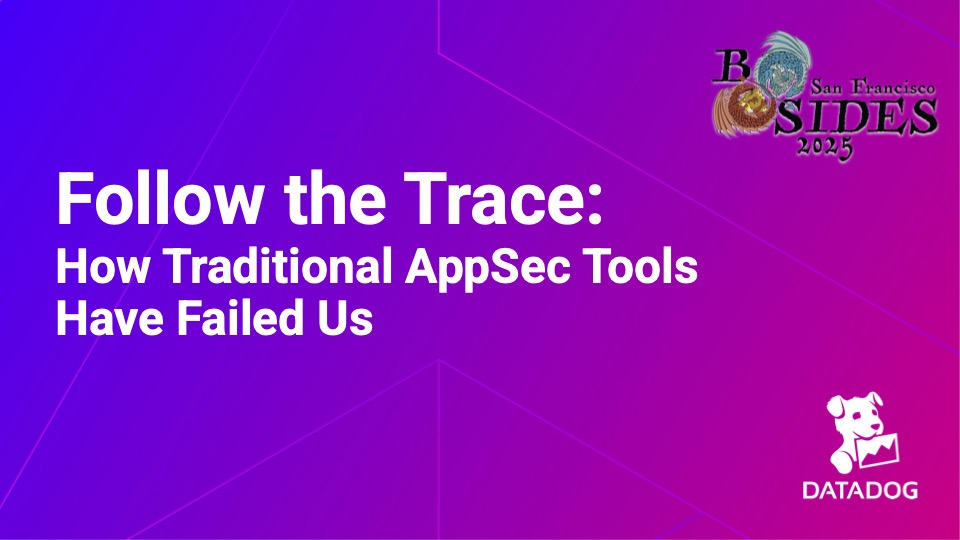

# BSidesSF 2025 - Follow the Trace: How Traditional AppSec Tools Have Failed Us 

## Resources
- [Slides](bsidessf_follow_the_trace.pdf)
- Recording - Coming Soon!
- [BSidesSF Website](https://sched.co/1x8Uw)

## Abstract
Join the journey of an application data trace as it navigates runtime application security. Follow a trace through an application, uncovering how tools like RASP provide real-time insights, detect threats, and block attacks. Learn how traces enhance security by revealing vulnerabilities in action.
